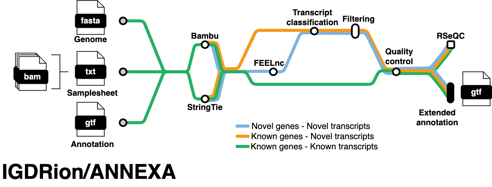

# ANNEXA: Analysis of Nanopore with Nextflow for EXtended Annotation

## Introduction

**ANNEXA** is an all-in-one reproductible pipeline, written in the [Nextflow](https://nextflow.io), which allows users to analyze LR-RNAseq sequences from Oxford Nanopore Technologies (ONT), and to reconstruct and quantify known and novel genes and isoforms.

## Pipeline summary



ANNEXA works by using only three parameter files (a reference genome, a reference annotation and mapping files) and provides users with an extended annotation distinguishing between novel protein-coding (mRNA) versus long non-coding RNAs (lncRNA) genes. All known and novel gene/transcript models are further characterized through multiple features (length, number of spliced transcripts, normalized expression levels,...) available as graphical outputs.

1. Check if the input annotation contains all the information needed.
2. Transcriptome reconstruction and quantification with [bambu](https://github.com/GoekeLab/bambu).
3. Novel classification with [FEELnc](https://github.com/tderrien/FEELnc).
4. Retrieve information from input annotation and format final gtf with 3 level structure: gene -> transcript -> exon.
5. Filter novel transcripts based on [bambu](https://github.com/GoekeLab/bambu) and/or [TransforKmers](https://github.com/mlorthiois/transforkmers) Novel Discovery Rates.
6. Perform a quality control of both the full and filtered extended annotations (see [example](https://github.com/mlorthiois/ANNEXA/blob/master/examples/results/qc_gtf.pdf)).
7. Optional: Check gene body coverage with [RSeQC](http://rseqc.sourceforge.net/#genebody-coverage-py).

This pipeline has been tested with reference annotation from Ensembl and NCBI-RefSeq.

## Usage

1. Install [Nextflow](https://www.nextflow.io/docs/latest/getstarted.html#installation)

2. Test the pipeline on a small dataset

```sh
nextflow run mlorthiois/ANNEXA \
    -profile test,conda
```

3. Run ANNEXA on your own data (change input, gtf, fa with path of your files).

```sh
nextflow run mlorthiois/ANNEXA \
    -profile {test,docker,singularity,conda,slurm} \
    --input samples.txt \
    --gtf /path/to/ref.gtf \
    --fa /path/to/ref.fa
```

The input parameter takes a file listing the bams to analyze (see example below)

```
/path/to/1.bam
/path/to/2.bam
/path/to/3.bam
```

### Options

```
Required:
--input             : Path to file listing paths to bam files.
--fa                : Path to reference genome.
--gtf               : Path to reference annotation.


Optional:
-profile test       : Run annexa on toy dataset.
-profile slurm      : Run annexa on slurm executor.
-profile singularity: Run annexa in singularity container.
-profile conda      : Run annexa in conda environment.
-profile docker     : Run annexa in docker container.

--filter            : Perform or not the filtering step. false by default.
--tfkmers_tokenizer : Path to TransforKmers tokenizer. Required if filter activated.
--tfkmers_model     : Path to TransforKmers model. Required if filter activated.
--bambu_threshold   : bambu NDR threshold below which new transcripts are retained.
--tfkmers_threshold : TransforKmers NDR threshold below which new transcripts are retained.
--operation         : Operation to retained novel transcripts. "union" retain tx validated by either bambu or transforkmers, "intersection" retain tx validated by both.

--withGeneCoverage  : Run RSeQC (can be long depending on annotation and bam sizes). False by default.

--maxCpu            : max cpu threads used by ANNEXA. 8 by default.
--maxMemory         : max memory used by ANNEXA. 40GB by default.
```

> If the filter argument is set to `true`, TransforKmers model and tokenizer paths have to be given. They can be either downloaded from the [TransforKmers official repository](https://github.com/mlorthiois/TransforKmers) or trained in advance by yourself on your own data.

## Automatic filtering step

By activating the filtering step (`--filter true`), ANNEXA proposes to filter the generated extended annotation according to 2 methods:

1. By using the NDR proposed by [bambu](https://github.com/GoekeLab/bambu). This threshold includes several information such as sequence profile, structure (mono-exonic, etc) and quantification (number of samples, expression). Each transcript with an NDR below the classification threshold will be retained by ANNEXA.
2. By analysing the TSS of each new transcript using the [TransforKmers](https://github.com/mlorthiois/TransforKmers) (deep-learning) tool. Each TSS validated below a certain threshold will be retained.

The filtered annotation can be the "union" of these 2 tools, i.e. all the transcripts validated by one or two of these tools; or the "intersection", i.e. the transcripts by these 2 tools.

At the end, the QC steps are performed both on the full and filtered extended annotations.
